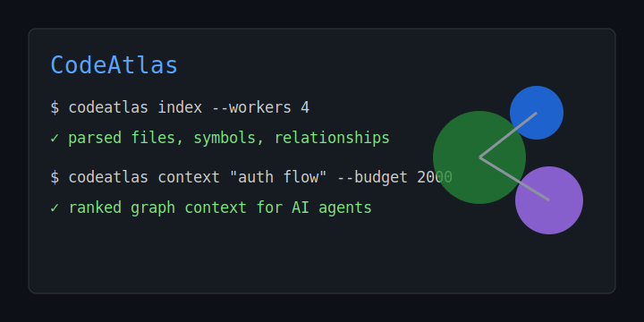
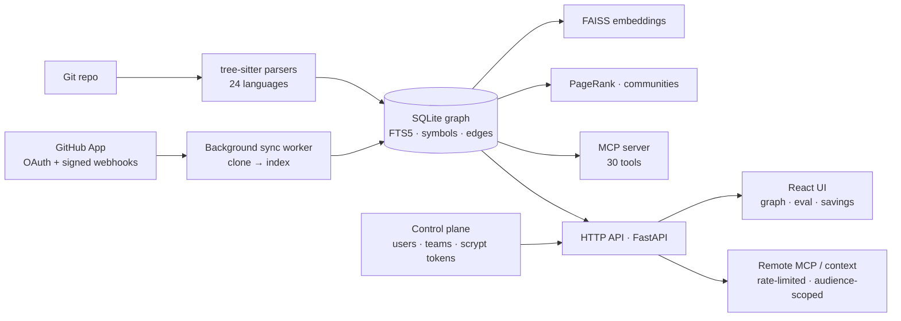
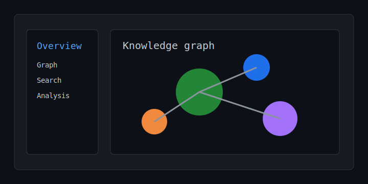

# Stratum

[](https://github.com/AryanSaini26/CodeAtlas/actions/workflows/ci.yml)
[](https://codecov.io/gh/AryanSaini26/CodeAtlas)
[](https://pypi.org/project/codeatlas/)
[](https://www.python.org/downloads/)
[](LICENSE)

Stratum is the hosted team context gateway powered by the open-source CodeAtlas engine. CodeAtlas constructs real-time code knowledge graphs of any repository and exposes them to AI coding agents like Claude Code, Codex, Cursor, and Copilot-compatible workflows through MCP, CLI, HTTP API, and a React web UI.

<!-- DEMO ASSET: docs/assets/hero.svg is a tracked placeholder.
     Replace with docs/assets/hero.gif after recording a 30s screencast of `codeatlas index`
     on a 100k-LOC repo, then an agent walking the graph with MCP tools,
     then the web UI rendering the force graph. Drop the file here. -->
<p align="center">
  
</p>

> **Live demo:** _set after deploy_ — `https://<your-domain>/welcome` ·
> **Docs:** https://aryansaini26.github.io/CodeAtlas/ ·
> **2-min walkthrough:** see [demo script](docs/demo-script.md)

**TL;DR** — a full-stack product that gives AI coding agents *persistent, measured*
codebase context. Python/FastAPI + React, a multi-tenant hosted control plane, a
GitHub App (OAuth + signed webhooks), a background sync worker, and a dashboard
that **measures** whether retrieval is actually good — not just a diagram.

| recall@k | MRR | context saved | languages | MCP tools | tests |
|:---:|:---:|:---:|:---:|:---:|:---:|
| **1.000** | **0.978** | **27–60%** | **24** | **30** | **1,140** |

## The Problem

AI coding agents waste 60-80% of their context window orienting themselves in a codebase before doing real work. Stratum gives teams persistent, shared CodeAtlas context so agents can navigate intelligently from the first token and teams can measure whether that context actually improves outcomes.

## Why Stratum / CodeAtlas

- **Persistent SQLite + FTS5 graph** — scales past 1M symbols, incrementally updated; not a flat `graph.json` re-serialized every run.
- **True embedding-based semantic search** — FAISS + sentence-transformers, not just keyword matching. Hybrid mode blends FTS5 + vectors via reciprocal rank fusion.
- **PageRank centrality** — caller-weighted importance, not degree-based "god node" heuristics. Plus label-propagation communities, git-churn hotspots, and coverage gaps.
- **30 MCP tools, 39 CLI commands, 6 export formats** — the widest agent and terminal surface in the category.
- **Full React web UI** — interactive force graph, search, symbol details, analysis tabs — all backed by a FastAPI layer. Launch with one command: `codeatlas ui`.
- **24 languages via tree-sitter** — Python, TypeScript/TSX, Go, Rust, JavaScript, Java, Kotlin, C, C++, C#, Ruby, PHP, Scala, Bash, Lua, Elixir, Swift, Haskell, SQL, Zig, OCaml, Julia, PowerShell, Svelte.
- **Hosted gateway foundation** — local-dev Stratum control plane with users, teams, bearer tokens, per-repo graph DBs, GitHub App metadata, webhook replay/sync, and a `/hosted` dashboard.

## Architecture



## Engineering decisions (the short version)

- **Measured retrieval as a product surface.** Recall@k / MRR / nDCG are shown in
  the dashboard, not buried in a CLI flag — the wedge versus diagram-only tools.
- **scrypt for token hashing** (stdlib, salted, memory-hard) instead of
  bcrypt/argon2 — strong without adding a native wheel.
- **In-process thread-pool sync worker** instead of Celery/Redis — webhooks
  return fast, deliveries are deduplicated by `X-GitHub-Delivery`, and it's
  right-sized for a single-VPS MVP.
- **SQLite + per-repo graph DBs** instead of Postgres — simple ops and natural
  per-repo isolation; a known tradeoff to revisit at multi-node scale.
- Full rationale, bottlenecks, and failure modes: [docs/ai-infra-case-study.md](docs/ai-infra-case-study.md).

## Screenshots

<p align="center">
  
</p>

<!-- Replace these with real captures from the live instance for max impact:
     docs/assets/graph.png        — the interactive graph (PageRank-sized, community-colored, blast-radius)
     docs/assets/eval.png         — the Agent Retrieval Eval bar chart
     docs/assets/context-feed.png — the Agent Context Feed
     Then reference them here. -->

The hosted dashboard surfaces what competitors don't: an **Agent Context Feed**
(what your agents actually retrieved), **measured retrieval quality** (recall/MRR
bars), **before/after token savings**, **blast-radius impact**, and **data
lineage** — all per repo.

## Measured Results

CodeAtlas ships with a reproducible AI-infra benchmark instead of only a feature list:

- Flagship proof report: `benchmarks/flagship-report.md` ties together retrieval quality, deterministic agent-outcome A/B, scale/perf, and data-lineage proof.
- Retrieval V2 report: 30 deterministic local tasks, context-pack best mode, 1.000 recall@k and 1.000 MRR, plus precision@k, nDCG@k, useful context density, edit-localization recall, and failure classes.
- Agent outcome report: `benchmarks/agent-live/report.md` runs a clearly labeled `mock_agent` A/B benchmark where the CodeAtlas-context variant passes verification and the prompt-only baseline fails.
- Scale report: `benchmarks/perf/report.md` indexes 3 local repos/fixtures with 481 files, 11,077 symbols, 33,036 relationships, and ~4,856 symbols/sec on the committed local run.
- Data lineage report: `benchmarks/data-lineage/report.md` extracts dbt + Airflow + SQL lineage and exports OpenLineage-shaped JSON.
- Latest committed local smoke report: 154 files, 3,371 symbols, 10,837 relationships, 1.000 symbol recall@k, 0.978 MRR, ~27% context savings, and ~978 symbols/sec on an Apple Silicon dev machine.
- Latest committed OSS suite report: 3 pinned repos, 314 files, 7,581 symbols, 21,443 relationships, 0.778 file recall@k, 0.476 multi-symbol recall@k, 0.578 MRR, and ~60% context savings.
- The committed OSS run intentionally labels semantic/hybrid as fallback; publish semantic comparisons with `--build-semantic --require-semantic` so fallback numbers cannot be mistaken for vector-search results.
- `benchmarks/report.md` is generated from `codeatlas bench . --profile --eval-suite benchmarks/eval-suite.json --output benchmarks/report.md`.
- `benchmarks/eval-suite.json` contains 30 golden retrieval tasks across symbol lookup, impact analysis, dependency tracing, architecture questions, context-pack retrieval, and SQL lineage.
- `benchmarks/oss-eval-suite.json` adds 45 deterministic real-repo tasks across pinned `requests`, `click`, and `rich` commits in `benchmarks/repos.lock.yml`.
- `benchmarks/agent-suite.json` defines optional live-agent A/B tasks that compare prompt-only baseline runs against CodeAtlas context-pack runs; CI uses `--dry-run` so no paid LLM or network clone is required.
- `codeatlas eval --compare` compares FTS/BM25, semantic, hybrid, PageRank, graph-neighborhood, and context-pack ranking paths with recall, precision, nDCG, MRR, latency, misses, and token-savings metrics.
- `codeatlas agent-eval --dry-run` writes deterministic `results.json`, `report.md`, and `failures.json`; adding `--agent-adapter shell|codex|claude|aider|mock` plus live options runs an explicitly labeled A/B benchmark.
- `codeatlas perf-report`, `codeatlas data-lineage`, and `codeatlas doctor --check ...` add production-style scale, lineage, and environment proof.
- Hosted MVP foundation: `codeatlas hosted bootstrap`, `register-repo`, and `sync` create a local-dev Stratum team context gateway with bearer tokens, repo metadata, sync events, per-repo graph DBs, and a `/hosted` dashboard.
- GitHub App sync foundation: `codeatlas hosted github status`, `refresh-repos`, `webhook-test`, and `sync` validate Stratum app config, refresh installation repos from a fixture/token source, record delivery IDs, clone hosted checkouts, activate GitHub repos, and trigger per-repo graph sync without live GitHub credentials in CI.
- Hosted security and remote context: repo-scoped `/remote-mcp` validates `X-Stratum-Audience`, serves context packs and graph summaries, and includes prompt-injection/secret/vendor-path scan results.
- `codeatlas context <query> --mode fts|semantic|hybrid|pagerank --build-semantic --budget 2000 --json` returns agent-ready context packs with definitions, callers, callees, file summaries, confidence labels, and budget trimming.
- `docs/ai-infra-case-study.md` explains architecture, tradeoffs, bottlenecks, failure modes, and how the benchmark changed implementation choices.
- `docs/startup-roadmap.md` frames the commercial wedge as agent infrastructure: persistent team context, evals, security, and observability for any coding agent.
- `docs/hosted-mvp.md` shows the local hosted gateway flow and the pieces intentionally stubbed before real OAuth, billing, and remote MCP routing.

```bash
codeatlas hosted bootstrap --hosted-db .codeatlas/hosted.db
codeatlas hosted register-repo --hosted-db .codeatlas/hosted.db --team default --path . --name codeatlas
codeatlas hosted sync --hosted-db .codeatlas/hosted.db --repo codeatlas
codeatlas ui --db .codeatlas/graph.db --hosted-db .codeatlas/hosted.db
stratum hosted github status --hosted-db .codeatlas/hosted.db
codeatlas hosted github refresh-repos --hosted-db .codeatlas/hosted.db --installation <installation-id>
codeatlas bench . --profile --eval-suite benchmarks/eval-suite.json --output benchmarks/report.md
codeatlas bench . --profile --eval-suite benchmarks/eval-suite.json --json --output benchmarks/results.json
codeatlas bench-suite --repos benchmarks/repos.lock.yml --suite benchmarks/oss-eval-suite.json --out benchmarks/oss --build-semantic --require-semantic
codeatlas agent-eval --suite benchmarks/agent-suite.json --repos benchmarks/repos.lock.yml --out benchmarks/agent --dry-run
codeatlas eval --suite benchmarks/eval-suite.json --db .codeatlas/graph.db --out benchmarks/retrieval-v2 --compare
codeatlas perf-report --repos benchmarks/local-repos.json --out benchmarks/perf --profile
codeatlas agent-eval --suite benchmarks/local-agent-suite.json --repos benchmarks/local-repos.json --out benchmarks/agent-live --agent-adapter mock --compare-baseline
codeatlas data-lineage --repo examples/data-pipeline --format openlineage -o benchmarks/data-lineage/openlineage.json
```

## Features

- **Multi-language parsing** — Tree-sitter AST parsing for 24 languages (list above).
- **Knowledge graph** — SQLite + FTS5 with recursive CTE graph traversals (zero infrastructure).
- **Semantic search** — FAISS vector search with sentence-transformers for natural language code queries.
- **Hybrid search** — Reciprocal rank fusion merging keyword (FTS5) and vector (FAISS) results.
- **Graph analysis** — PageRank, community detection, cycle detection, dead code, hotspots, coverage gaps, shortest path, file coupling.
- **Interactive visualization** — React + react-force-graph web UI, plus a standalone D3.js HTML export.
- **HTTP/JSON API** — FastAPI layer over the graph for custom frontends and tooling.
- **Real-time sync** — Watchdog file watcher and GitHub webhook handler for incremental updates.
- **Change impact analysis** — Git-aware diff analysis showing which symbols and files are affected.
- **MCP server** — 30 tools exposed via the Model Context Protocol for AI agent consumption.
- **Graph export** — DOT (Graphviz), JSON (D3.js), Mermaid, GraphML, CSV, and Cypher formats.
- **Config files** — Optional `codeatlas.toml` for per-repo settings.

## Quick Start

```bash
pip install codeatlas

# Initialize a config file (optional)
codeatlas init

# Index a repository
codeatlas index /path/to/repo

# View graph statistics
codeatlas stats

# Search by keyword
codeatlas query "authentication"

# Search by natural language (requires sentence-transformers)
codeatlas query "where do we handle login errors" --semantic

# Inspect a specific symbol
codeatlas show UserService

# Run code quality audit (cycles, dead code, complexity)
codeatlas audit

# Visualize the graph in your browser
codeatlas viz --open

# Watch for file changes
codeatlas watch /path/to/repo

# Export the graph
codeatlas export --format dot -o graph.dot
codeatlas export --format json -o graph.json
codeatlas export --format mermaid -o diagram.md

# Launch the web UI (API + React frontend, one command)
codeatlas ui
```

## Web UI

CodeAtlas ships with a React + TypeScript frontend built on Vite, Tailwind, and react-force-graph. It talks to a FastAPI layer over the same graph store — so the CLI, MCP server, and web UI all see identical data.

```bash
# Build the frontend once
cd frontend && npm install && npm run build && cd ..

# Serve API + UI on localhost:8080
codeatlas ui

# Or run them separately during development
codeatlas server --port 8080              # API only
cd frontend && npm run dev                # Vite dev server with /api proxy
```

The UI surfaces:
- **Dashboard** — top symbols by PageRank, file hotspots, language & symbol breakdown, statistics
- **Search** — full-text + semantic search with result detail pane showing signature, docstring, incoming/outgoing references
- **Analysis** — tabbed interface with PageRank ranking, hotspot identification, community detection, coverage gap analysis
- **Graph** — interactive force-directed visualization with kind/community coloring, legend, and file filtering
- **Symbols** — detailed symbol pages with signature, docs, file location, incoming/outgoing reference cards
- **Diff** — compare symbols between two git refs (added/removed/modified columns)
- **Settings** — configure API credentials, trigger incremental/full reindex, view version info

<!-- DEMO ASSET: docs/assets/web-ui.svg is a tracked placeholder.
     Replace with docs/assets/web-ui.gif after recording a walkthrough of the force graph,
     search, symbol details, and the diff view. -->
<p align="center">
  
</p>

## Installation

```bash
# Core (parsing + graph + CLI)
pip install codeatlas

# With MCP server
pip install codeatlas[mcp]

# With semantic search
pip install codeatlas[search]

# Everything
pip install codeatlas[all]
```

## Supported Languages

| Language | Extensions | Extractions |
|----------|-----------|-------------|
| **Python** | `.py` | Classes, functions, methods, decorators, docstrings, imports, inheritance |
| **TypeScript/TSX** | `.ts`, `.tsx` | Functions, classes, interfaces, type aliases, exports, generics, JSDoc |
| **JavaScript** | `.js`, `.mjs`, `.cjs` | Classes, functions, arrow functions, imports, exports, JSDoc |
| **Go** | `.go` | Functions, methods, structs, interfaces, packages, type aliases |
| **Rust** | `.rs` | Structs, traits, enums, impl blocks, type aliases, `///` doc comments |
| **Java** | `.java` | Classes, interfaces, enums, records, constructors, Javadoc, annotations |
| **Kotlin** | `.kt`, `.kts` | Classes, interfaces, objects, companion objects, functions, KDoc |
| **C/C++** | `.cpp`, `.cc`, `.cxx`, `.hpp`, `.hxx`, `.h` | Classes, structs, enums, namespaces, templates, inheritance, `///`/`/** */` docs |
| **C#** | `.cs` | Classes, interfaces, structs, enums, records, properties, XML doc comments, inheritance |
| **Ruby** | `.rb` | Classes, modules, methods, constants, require imports, `#` doc comments |
| **PHP** | `.php` | Classes, interfaces, traits, functions, use imports, PHPDoc |
| **Scala** | `.scala`, `.sc` | Classes, traits, objects, functions, val/var, Scaladoc |
| **Bash** | `.sh`, `.bash` | Functions, UPPER_CASE constants, `#` doc comments, call relationships |
| **Lua** | `.lua` | Functions, local functions, function expressions, variables, `--` doc comments |
| **Elixir** | `.ex`, `.exs` | Modules, protocols (interfaces), def/defp functions, `@doc` docstrings |
| **Swift** | `.swift` | Classes, structs, protocols (interfaces), functions, methods, typealiases, `///`/`/** */` docs |
| **Haskell** | `.hs`, `.lhs` | Functions, data types, type aliases, newtypes, typeclasses (interfaces), imports, call relationships |
| **SQL** | `.sql` | Tables, views (CLASS), functions/procedures (FUNCTION), cross-table CALLS from views and functions |
| **C** | `.c` | Functions, typedef structs/enums (CLASS), type aliases, includes (IMPORT), call relationships |
| **Zig** | `.zig` | Functions, structs/enums/unions (CLASS), `@import` (IMPORT), UPPER_CASE constants, call relationships |
| **OCaml** | `.ml`, `.mli` | Functions (`let`), types (CLASS), modules (MODULE), module methods, `open` imports, call relationships |
| **Julia** | `.jl` | Modules, structs (CLASS), abstract types (INTERFACE), functions, macros, `import`/`using`, constants, `#` doc comments |
| **PowerShell** | `.ps1`, `.psm1`, `.psd1` | Functions, classes, methods, constructors, `#` doc comments, cmdlet call relationships |
| **Svelte** | `.svelte` | Component (CLASS), `<script>` functions, arrow functions, `import` statements, call relationships |

## Configuration

CodeAtlas can be configured with a `codeatlas.toml` file in your repository root. Generate one with:

```bash
codeatlas init
```

Example `codeatlas.toml`:

```toml
[codeatlas]
exclude_dirs = [".git", ".venv", "node_modules", "__pycache__", "dist", "build"]

[codeatlas.parser]
max_file_size_kb = 500
include_extensions = [".py", ".ts", ".tsx", ".js", ".mjs", ".go", ".rs", ".java", ".kt", ".kts", ".cpp", ".cc", ".cxx", ".hpp", ".hxx", ".h", ".cs", ".rb", ".php", ".scala", ".sc", ".sh", ".bash", ".lua", ".ex", ".exs", ".swift", ".hs", ".lhs", ".sql", ".c", ".zig", ".ml", ".mli"]

[codeatlas.graph]
db_path = ".codeatlas/graph.db"
```

If no config file is found, sensible defaults are used.

### Ignore files with `.gitignore` / `.codeatlas-ignore`

CodeAtlas automatically honors the repo's `.gitignore` (if present). Add a
`.codeatlas-ignore` in the repo root when you need extra rules or to negate
gitignore entries; its patterns are applied after the gitignore rules and
can override them.

Place a `.codeatlas-ignore` file in your repository root to exclude specific
files or directories from indexing. The syntax mirrors `.gitignore`:

```text
# Skip generated artifacts
dist/
build/
*.log

# Skip a specific file (but re-include one via negation)
src/generated/
!src/generated/manifest.ts
```

Supported: comments (`#`), blank lines, glob patterns (`*`, `**`, `?`),
directory-only patterns (`foo/`), and negation (`!pattern`).

### Relationship confidence

Every edge in the graph is tagged with a confidence level so agents can tell
AST-proven facts apart from heuristic guesses:

| Confidence | Meaning |
|------------|---------|
| `extracted` | Directly present in the parser output (same-file resolution). Trust. |
| `inferred`  | Resolved by unique name lookup across files. Likely correct. |
| `ambiguous` | Multiple candidate targets existed; a heuristic chose one. Treat with caution. |

`codeatlas report` surfaces the counts; the raw stats are also available via
`GraphStore.get_confidence_stats()`. Exported JSON edges carry the same tag:
`codeatlas export --format json` emits `{"source", "target", "kind", "confidence"}`,
and the interactive visualization draws inferred edges dashed and ambiguous ones
dotted so heuristic guesses are visible at a glance.

### Community view

Pass `--communities` to `codeatlas export` or `codeatlas viz` to run label
propagation on the graph and include a `community_id` on each node. In the
interactive visualization, nodes are painted by community and a toolbar toggle
switches between community-coloring and kind-coloring.

## CLI Commands

| Command | Description |
|---------|-------------|
| `codeatlas init` | Generate a `codeatlas.toml` config file |
| `codeatlas index [path]` | Index a repository into the knowledge graph |
| `codeatlas index [path] --incremental` | Only re-index files that changed |
| `codeatlas index [path] --watch` | Index then keep watching for file changes |
| `codeatlas index [path] --workers N` | Parse files in parallel across N processes |
| `codeatlas diff [path]` | Show files that changed since the last index |
| `codeatlas stats` | Show graph statistics (files, symbols, relationships) |
| `codeatlas list-files` | List all indexed files with language and symbol counts |
| `codeatlas query <term>` | Full-text search across the codebase |
| `codeatlas query <term> --semantic` | Natural language semantic search |
| `codeatlas query <term> --hybrid` | Combined FTS + semantic search |
| `codeatlas query <term> --json` | Output results as a JSON array |
| `codeatlas show <symbol>` | Inspect a symbol's signature, docs, deps, and call chain |
| `codeatlas show <symbol> --json` | Output symbol details as JSON |
| `codeatlas audit` | Run code quality analysis (cycles, dead code, complexity) |
| `codeatlas audit --json` | Output audit results as JSON |
| `codeatlas audit --include-tests` | Include test-file symbols in dead code analysis |
| `codeatlas find-path <src> <tgt>` | Find shortest dependency path between two symbols |
| `codeatlas coupling` | Show file coupling analysis |
| `codeatlas hotspots [path]` | Show highest-risk files (git churn × graph in-degree) |
| `codeatlas hotspots [path] --json` | Output hotspots as JSON |
| `codeatlas hubs` | Show hub symbols, the most-connected ("god") nodes in the graph |
| `codeatlas hubs --json` | Output hub symbols as JSON |
| `codeatlas rank` | Rank symbols by PageRank (weighted by caller importance, not raw degree) |
| `codeatlas rank --kind class --json` | Rank restricted to a kind, output as JSON |
| `codeatlas communities` | Detect tightly-connected subsystems via label propagation |
| `codeatlas communities --json` | Output community groupings as JSON |
| `codeatlas coverage-gaps` | Show public symbols with zero test coverage |
| `codeatlas report [path]` | Generate a full health report (cycles, dead code, hotspots, gaps) |
| `codeatlas report [path] --json` | Output health report as JSON |
| `codeatlas agent-eval --suite S --repos R --out D --dry-run` | Validate agent outcome tasks and write deterministic artifacts |
| `codeatlas agent-eval --suite S --repos R --out D --agent-adapter mock --compare-baseline` | Run deterministic mock-agent A/B evaluation |
| `codeatlas agent-eval --suite S --repos R --out D --agent-adapter shell --agent-command "<cmd>" --compare-baseline` | Run prompt-only vs CodeAtlas-context live-agent A/B evaluation |
| `codeatlas perf-report --repos R --out D --profile` | Generate a scale/systems performance report |
| `codeatlas doctor --db DB --check semantic,mcp,api,bench` | Validate environment, graph DB, and optional infra |
| `codeatlas data-lineage --repo PATH --format openlineage` | Extract dbt/Airflow/SQL lineage and export OpenLineage-shaped JSON |
| `codeatlas lineage-impact <dataset-or-model>` | Trace downstream data-pipeline impact |
| `codeatlas pre-commit` | Add a CodeAtlas incremental-index hook to `.pre-commit-config.yaml` |
| `codeatlas impact [path]` | Analyze impact of current git changes on the graph |
| `codeatlas export` | Export graph in DOT or JSON format |
| `codeatlas export --communities` | Include per-node `community_id` (and color nodes by community in DOT) |
| `codeatlas viz` | Generate interactive D3.js graph visualization |
| `codeatlas viz --communities` | Color nodes by detected community; adds a toolbar toggle (community/kind) |
| `codeatlas watch [path]` | Watch for file changes and update graph in real-time |
| `codeatlas webhook [path]` | Start a GitHub webhook server for push-triggered updates |
| `codeatlas trace <symbol>` | Trace call chain from a symbol (depth-limited BFS) |
| `codeatlas find-usages <symbol>` | Find every call site and reference to a symbol |
| `codeatlas languages` | List all supported languages and file extensions |
| `codeatlas clean` | Remove the `.codeatlas` directory |
| `codeatlas serve` | Start the MCP server |
| `codeatlas server` | Start the HTTP/JSON API (FastAPI + Uvicorn) |
| `codeatlas ui` | Start the API and serve the built web UI in one command |
| `codeatlas install-completion [shell]` | Print the shell completion activation line (bash/zsh/fish) |

## MCP Server

Start the MCP server for use with Claude Code, Cursor, or any MCP-compatible agent:

```bash
codeatlas serve
```

### Claude Code Configuration

Add to your Claude Code MCP settings:

```json
{
  "mcpServers": {
    "codeatlas": {
      "command": "codeatlas",
      "args": ["serve"]
    }
  }
}
```

### Available MCP Tools (30)

| Tool | Description |
|------|-------------|
| `get_file_overview` | Structural summary of a source file |
| `get_dependencies` | What a symbol depends on and what depends on it |
| `get_symbol_details` | Full metadata + relationships for a symbol in one call |
| `list_symbols_by_kind` | List all symbols of a kind (e.g. "show me all classes") |
| `trace_call_chain` | Full call graph traversal from a symbol |
| `get_impact_analysis` | What breaks if a symbol changes |
| `search_symbols` | Full-text search with optional kind/file filters and query expansion |
| `find_similar_code` | Natural language semantic search |
| `get_module_overview` | Directory/module summary |
| `get_file_dependencies` | File-level dependency graph |
| `get_graph_stats` | Summary statistics of the indexed graph |
| `export_graph` | Export graph in DOT or JSON format |
| `detect_circular_dependencies` | Find import/call cycles in the codebase |
| `find_dead_code` | Find symbols with zero incoming references |
| `analyze_complexity` | Symbol centrality (most coupled/critical code) |
| `find_path_between_symbols` | Shortest dependency path between two symbols |
| `get_file_coupling` | Cross-file relationship density analysis |
| `get_change_impact` | Git-aware change impact analysis |
| `find_by_decorator` | Find all symbols tagged with a given decorator/annotation |
| `get_symbol_history` | Git blame/log history for a symbol (commits that touched it) |
| `get_hotspots` | Highest-risk files: git churn × graph in-degree |
| `get_symbol_coverage` | Which test functions reference a given symbol |
| `get_api_surface` | All public non-test symbols — the exported API |
| `get_coverage_gaps` | Public symbols with zero test coverage — prioritise these for new tests |
| `get_file_content` | Return raw source content of a file, optionally sliced to a line range |
| `find_usages` | Find every call site, import, and reference to a symbol (inverse of trace) |
| `get_symbol_context` | Symbol metadata + surrounding source snippet in one call |
| `get_agent_context` | Token-budgeted, ranked context pack for AI coding agents |

## Graph Visualization

Generate an interactive force-directed graph of your codebase:

```bash
# Generate and open in browser
codeatlas viz --open

# Save to a specific file
codeatlas viz -o my-graph.html

# Filter to specific directory
codeatlas viz --file-filter src/core/
```

The visualization features:
- Force-directed layout with D3.js
- Color-coded nodes by symbol kind (class, function, interface, etc.)
- Hover to highlight a symbol's direct connections
- Search bar to filter symbols by name
- Zoom and pan with mouse
- Drag nodes to rearrange

## GitHub Webhook

For automatic graph updates on push:

```bash
codeatlas webhook /path/to/repo --port 9000 --secret YOUR_WEBHOOK_SECRET
```

Then configure your GitHub repo webhook to POST to `http://your-server:9000/webhook`.

## Architecture

```
Source Files --> Tree-sitter AST --> Symbols + Relationships --> SQLite Graph
                                                                    |
                                                 +--------+---------+--------+
                                                 |        |         |        |
                                              FTS5     FAISS     Graph    D3.js
                                             Search   Vectors   Analysis   Viz
                                                 |        |         |        |
                                                 +--------+---------+--------+
                                                              |
                                                   CLI + MCP Server --> AI Agents
```

**Design decisions:**
- SQLite over Neo4j: zero infrastructure, ships with Python, FTS5 for keyword search, recursive CTEs for graph traversals
- FAISS over pgvector: runs locally without a database server
- Tree-sitter over regex: incremental parsing, handles all edge cases, cross-language consistency

## Development

```bash
# Clone and set up
git clone https://github.com/AryanSaini26/CodeAtlas.git
cd CodeAtlas
python3.12 -m venv .venv
.venv/bin/pip install -e ".[all,dev]"

# Run tests with coverage (latest local gate: 1067 tests, 91.41% coverage)
.venv/bin/pytest -v --cov=codeatlas --cov-report=term-missing

# Lint / format
.venv/bin/ruff check src tests
.venv/bin/ruff format src tests

# Benchmarks and eval comparison
codeatlas bench . --profile --eval-suite benchmarks/eval-suite.json --output benchmarks/report.md
```

## Releasing

Releases are fully automated via GitHub Actions. To cut a new release:

```bash
# Bump version, tag, and push — CI will build and publish to PyPI
make release VERSION=0.2.0
```

Requires:
1. PyPI Trusted Publishing configured at pypi.org for this repo (no API tokens needed)
2. `GITHUB_TOKEN` is automatic — no extra secrets required

## License

MIT
