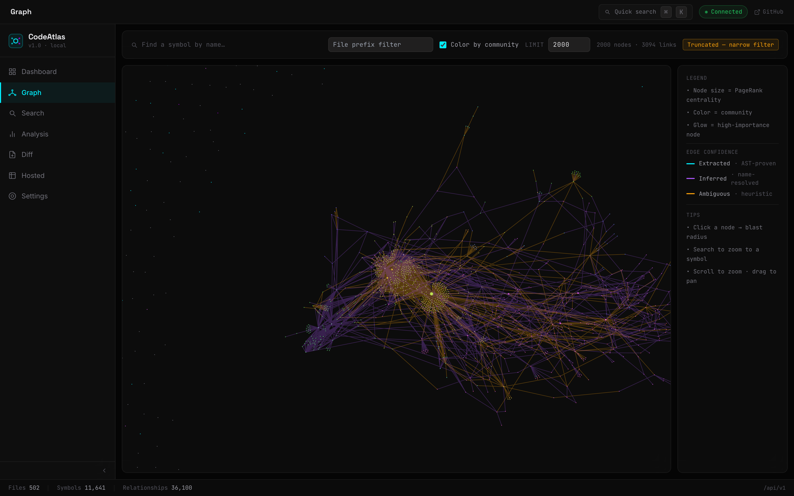
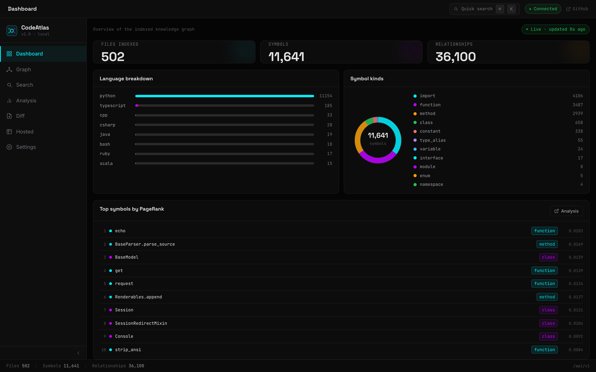
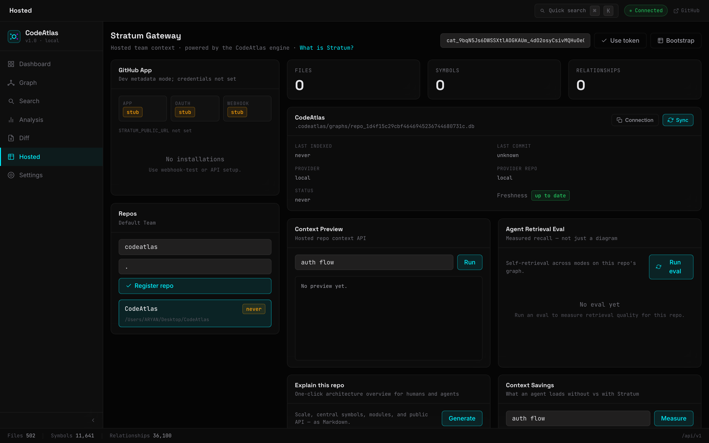
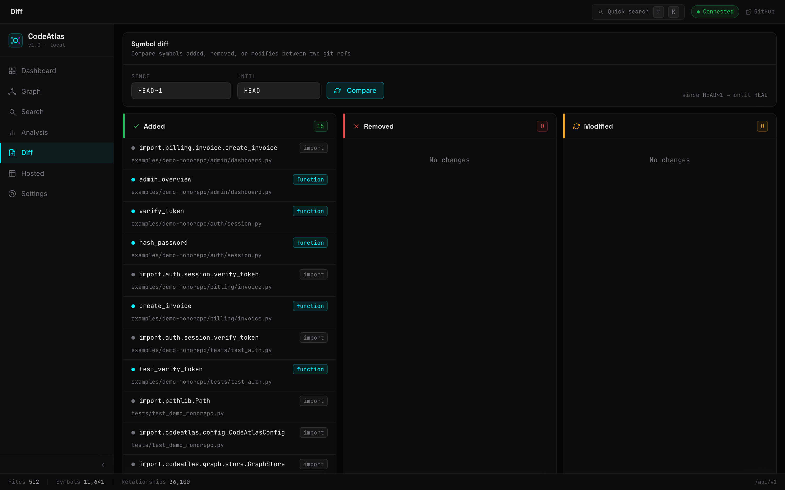

# Stratum — persistent context infrastructure for AI agents

> Hosted team context powered by the CodeAtlas engine: tree-sitter parsers, a persistent SQLite + FTS5 graph, FAISS semantic search, PageRank centrality, GitHub App sync foundation, and a 30-tool MCP surface.



## Why it exists

AI coding agents waste most of their context window orienting themselves in a codebase. Stratum gives teams a persistent CodeAtlas-backed structural and semantic index so agents can navigate intelligently from the first token — no repeated greps, no hallucinated call chains.

## What makes it different

| | Stratum / CodeAtlas | Typical alternatives |
|---|---|---|
| Storage | Persistent SQLite + FTS5 (1M+ symbols) | Flat `graph.json` re-serialized every run |
| Semantic search | FAISS + MiniLM embeddings | Keyword grep only |
| Centrality | PageRank (caller-weighted) | Degree-based "god nodes" |
| MCP surface | 30 tools | 3–5 tools |
| CLI surface | 39 commands | <10 |
| Interactive UI | React SPA + FastAPI | Static HTML export |
| Incremental sync | watchdog + webhook + pre-commit | Full reindex each run |

## 30-second tour

```bash
pip install codeatlas
codeatlas index /path/to/repo
stratum ui                         # API + web UI on :8080
```

Point Claude Code at `codeatlas serve` to hand agents 30 MCP tools over the same graph:

```json
{
  "mcpServers": {
    "codeatlas": { "command": "codeatlas", "args": ["serve"] }
  }
}
```

## Screens







## What's in the box

- **24 languages** via tree-sitter — Python, TypeScript/TSX, Go, Rust, JavaScript, Java, Kotlin, C, C++, C#, Ruby, PHP, Scala, Bash, Lua, Elixir, Swift, Haskell, SQL, Zig, OCaml, Julia, PowerShell, Svelte.
- **Graph analysis** — PageRank, label-propagation communities, cycle detection, dead code, hotspots, coverage gaps, shortest path, file coupling.
- **Exports** — DOT, JSON, Mermaid, GraphML, CSV, Cypher.
- **Sync** — file watcher, GitHub webhook, `pre-commit install` hook.
- **Visibility** — CLI, HTTP/JSON API, React web UI, VS Code extension.

## Links

- GitHub: <https://github.com/AryanSaini26/CodeAtlas>
- PyPI: <https://pypi.org/project/codeatlas/>
- Docs: <https://aryansaini26.github.io/CodeAtlas/>
- VS Code extension: *(pending marketplace publish)*
